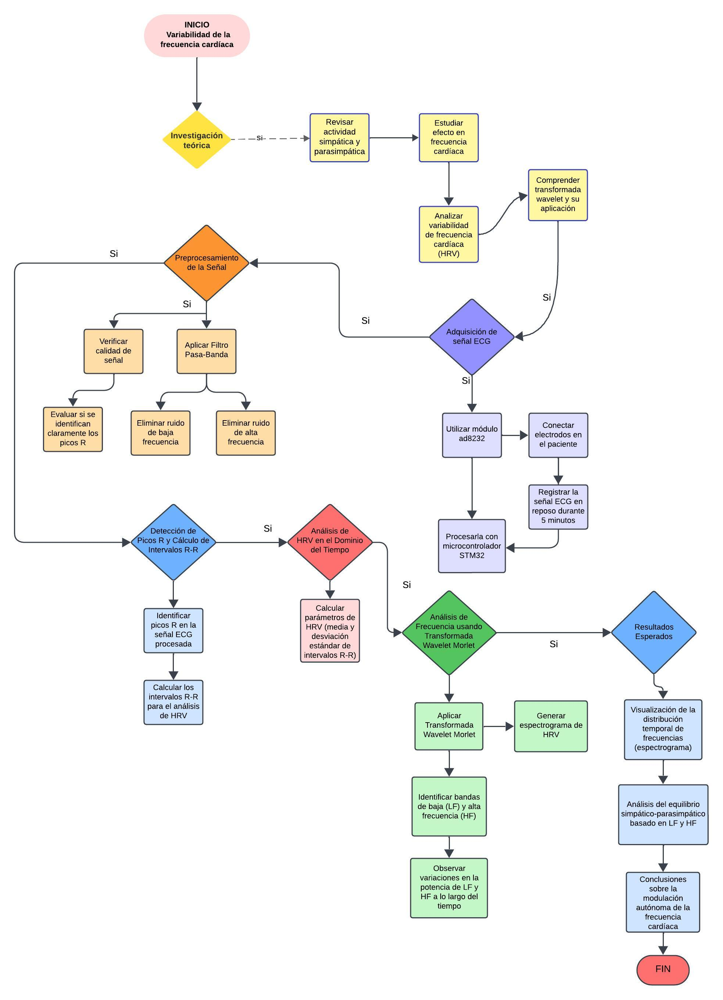
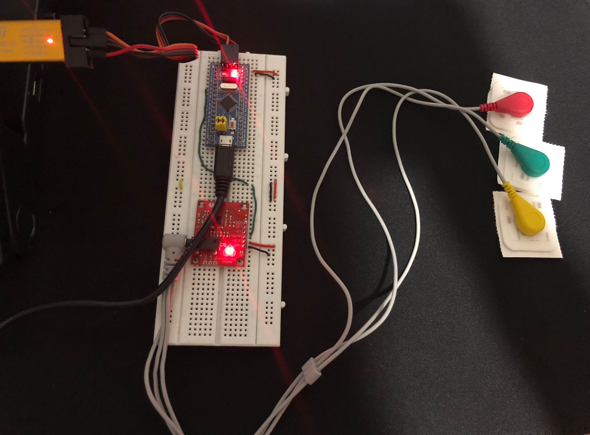
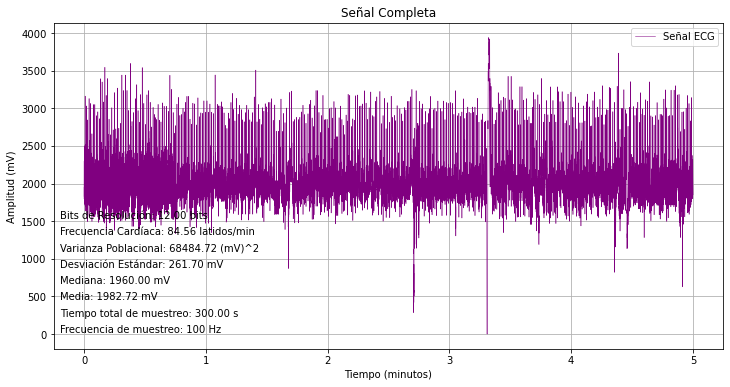
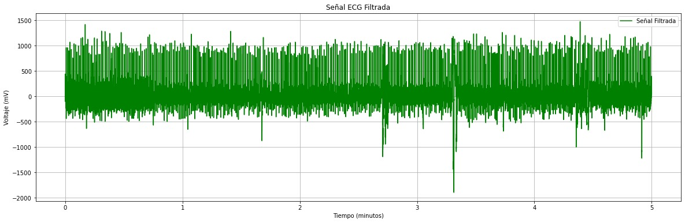
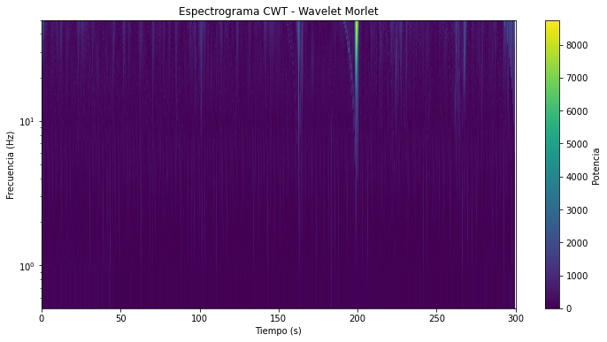

# LABORATORIO 4 - Variabilidad de la Frecuencia Cardiaca usando la Transformada Wavelet
## TABLA DE CONTENIDOS

1. [Objetivo y Metodología del Experimento](#objetivo-y-metodología-del-experimento)
2. [Fundamento teórico](#fundamento-teórico)
3. [Diagrama de flujo mostrando el plan de acción para cumplir el objetivo de la práctica](#diagrama-de-flujo-mostrando-el-plan-de-acción-para-cumplir-el-objetivo-de-la-práctica)
4. [Adquisición de la señal](#adquisición-de-la-señal)
5. [Pre-procesamiento de la señal](#pre--procesamiento-de-la-señal)
6. [Análisis de la HRV en el dominio del tiempo](#análisis-de-la-hrv-en-el-dominio-del-tiempo)
7. [Aplicación de transformada Wavelet](#aplicación-de-transformada-wavelet)
8. [Aplicación biomédica](#aplicación-biomédica)
9. [Consentimiento informado](#consentimiento-informado)
   
## OBJETIVO Y METODOLOGÍA DEL EXPERIMENTO
El objetivo esencial de la presente práctica es analizar la variabilidad de la frecuencia cardíaca (HRV) haciendo uso de la aplicación de la transformada wavelet, permitiendo identificar cambios en las frecuencias características asociadas con la actividad simpática y parasimpática del sistema nervioso autónomo. Posterior al análisis, se pretender comprender cómo varían estas frecuencias a lo largo del tiempo en una señal cardíaca en reposo, observando sus patrones temporales y espectrales. Este enfoque permitirá una interpretación más precisa de la dinámica temporal de la señal cardíaca, facilitando la identificación de tendencias y características clave que aporten información relevante sobre el comportamiento de la HRV en diferentes estados fisiológicos.

En una primera instancia, se realiza una investigación sobre el sistema nervioso autónomo y su impacto en la frecuencia cardíaca, así como en la variabilidad de la frecuencia cardíaca (HRV) y el uso de la transformada wavelet en señales biológicas. Asimismo, se adquiere la señal ECG con el módulo AD8232 y se registra la señal del estudiante durante 5 minutos en reposo asegurando una frecuencia de muestreo adecuado para capturar con precisión los intervalos R-R. En el mismor orden de ideas, se aplican filtros digitales para eliminar el ruido y detectar los picos R en la señal, calculando los intervalos R-R y poder calcular la media y desviación estándar de dichos intervalos y finalmente poder generar un espectrograma de HRV usando transformada wavelet continua para analizar cambios en las frecuencias de baja y alta frecuencia a lo largo del tiempo.

## FUNDAMENTO TEÓRICO
Es necesario tener como punto de partida aspectos esenciales al momento de abordar la presente prática, en este caso, se habla de la actividad simpática y parasimpática del sistema nervioso autónomo. Entendiendo que el sistema simpático es el responsable de la respuesta de "lucha" o "huida" y se activa en situaciones de peligro, estrés o actividad física intensa. El sistema simpático aumenta la frecuencia cardíaca, la presión arterial y prepara al cuerpo para responder a situaciones de emergencia. En contraparte, el sistema parasimpático, se asocia con la respuesta de "descanso y digestión", el cual, actúa en momentos de calma y relajación, disminuyendo la frecuencia cardíaca y favoreciendo el estado de reposo y recuperación del cuerpo. Es de importancia resaltar que, los dos sistemas nombrados operan de manera antagonista para mantener el equilibrio fisiológico del organismo, y sus efectos pueden analizarse a través de variaciones en la frecuencia cardíaca.
Ahora bien, la actividad del sistema nervioso autónomo influye en los intervalos entre latidos cardíacos de la siguiente manera:
- Simpático: Aumenta la frecuencia cardíaca al acortar el intervalo entre latidos.
- Parasimpático: Disminuye la frecuencia cardíaca al alargar el intervalo entre latidos.
  
Este equilibrio puede observarse a través de la variabilidad de la frecuencia cardíaca (HRV), un indicador de cómo se alternan las influencias simpáticas y parasimpáticas en la frecuencia cardíaca, proporcionando información sobre el estado de salud del sistema nervioso autónomo.

Si bien, la HRV mide las variaciones en el tiempo entre latidos sucesivos, conocidos como intervalos R-R en el electrocardiograma (ECG). Estas fluctuaciones reflejan cómo el sistema nervioso autónomo regula la frecuencia cardíaca. Una mayor HRV sugiere una mejor capacidad de adaptación del sistema nervioso autónomo, mientras que una HRV baja puede indicar estrés o problemas de salud.

En el análisis de HRV, se suele dividir en:

- Baja frecuencia (LF): relacionada con la actividad simpática y parasimpática, se encuentra entre 0.04 y 0.15 Hz.
- Alta frecuencia (HF): predominantemente influenciada por el sistema parasimpático, se encuentra entre 0.15 y 0.4 Hz.

A modo que, la relación entre estas frecuencias puede indicar el equilibrio entre ambas ramas del sistema autónomo.

Por otro lado, la transformada wavelet es una herramienta matemática que descompone una señal en componentes de frecuencia que varían con el tiempo. A diferencia de la transformada de Fourier, la wavelet es adecuada para analizar señales no estacionarias, como las biológicas, que cambian en el tiempo. En HRV, se utiliza la transformada wavelet continua (CWT) para observar cómo varían las frecuencias de baja y alta frecuencia en diferentes momentos, proporcionando una vista detallada de los cambios en la señal. Hay diferentes tipos de wavelets comunes en señales biológicas, 2 de estas son: 
- Wavelet de Morlet: Ideal para el análisis de frecuencias en señales biológicas
- Wavelet de Daubechies: útil para detectar cambios rápidos, como en las ondas R de un ECG.

Sin embargo, se implemento la wavelet de Morlet, ya que, proporciona un balance adecuado entre la resolución en tiempo y frecuencia, lo que facilita el análisis de señales biológicas (en este caso ECG). Es útil para captar tanto las variaciones de baja frecuencia (LF) como las de alta frecuencia (HF) en la HRV. Es excelente para descomponer la HRV en componentes espectrales y observar cómo se modulan en el tiempo, haciendo visible la influencia del sistema nervioso autónomo.


## DIAGRAMA DE FLUJO MOSTRANDO EL PLAN DE ACCIÓN PARA CUMPLIR EL OBJETIVO DE LA PRÁCTICA

A continuación se muestra el diagrama de flujo que representa el plan de ejecución de la presente práctica: 





## ADQUISICIÓN DE LA SEÑAL
En un inicio, la adquisición de la señal ECG fue ejecutada a través del uso de un un módulo AD8232, el cual permite captar de forma precisa la actividad cardíaca en tiempo real. Este módulo se integró con el microcontrolador STM32, que procesó la señal capturada y facilitó su almacenamiento en un archivo de texto que se importó a python para poder visualizar la señal.

La imagen adjunta muestra el montaje experimental para obtener la señal ECG del paciente:
<div style="text-align: center;">
    
</div>


Por otro lado, a continuación se muestra la gráfica de la señal cruda con todas sus características:




Se empleó una frecuencia de muestreo de 100 Hz, apropiado para obtener una representación básica de la señal ECG. Con un tiempo total de muestreo de 300 segundos (5 minutos), se logró una cantidad adecuada de datos para realizar un análisis detallado tanto en el dominio del tiempo como en el dominio de frecuencia. Del mismo modo, para garantizar la precisión de la señal captada, se configuró el sistema a una resolución de 12 bits, lo cual permite una representación detallada de las variaciones de voltaje en la señal ECG.

En concordancia, la señal adquirida presenta una media de 1982.72 mV y una mediana de 1960.00 mV, valores que indican la estabilidad de la señal alrededor de su valor central y ayudan a verificar su simetría. La varianza poblacional es de 68484.72 (mV)^2 y la desviación estándar es de 261.70 mV, lo cual refleja la dispersión de los valores de voltaje respecto a la media y permite evaluar la consistencia de la señal. 

Finalmente, a partir de la señal ECG se calculó una frecuencia cardíaca de 84.56 latidos por minuto, lo cual proporciona una base adecuada para el análisis de la variabilidad de la frecuencia cardíaca (HRV) en los dominios requeridos por el estudio.


## PRE- PROCESAMIENTO DE LA SEÑAL

Como primer parámetro, se utiliza un filtro Butterworth pasabanda para procesar la señal ECG. ¿Por qué?. bien, un filtro pasabanda permite solo el paso de las frecuencias entre dos valores de corte (una frecuencia baja y una alta), eliminando las frecuencias fuera de este rango. Esto es útil para eliminar ruidos de alta y baja frecuencia que no pertenecen a la señal ECG.

Uso de la función butter_bandpass

```
def butter_bandpass(lowcut, highcut, fs, order=4):
    nyquist = 0.5 * fs  # Frecuencia de Nyquist
    low = lowcut / nyquist
    high = highcut / nyquist
    b, a = butter(order, [low, high], btype='band')
    return b, a
```

Donde lowcut y highcut son frecuencias de corte inferior y superior del filtro, respectivamente. Estas definen el rango de frecuencias permitidas. Asimismo, fs es la frecuencia de muestreo de la señal y order el orden del filtro, que determina la pendiente del filtro. Un orden más alto da un filtro más “empinado” o selectivo. 

Además, la  frecuencia de  Nyquist se calcula como nyquist = 0.5 * fs. Es la mitad de la frecuencia de muestreo y representa el límite máximo de frecuencia que puede ser analizado sin aliasing. Después, se divide cada frecuencia de corte por la frecuencia de Nyquist, resultando en valores de corte low y high que el filtro utiliza para determinar las bandas de paso (Normalización de frecuencias de corte) y finalmente ```butter``` genera los coeficientes b y a para el filtro Butterworth pasabanda, aplicando el tipo de filtro (```btype='band'```  indica un filtro pasabanda).

Al momento de aplicar el filtro a la señal, la función "aplicar_filtro" aplica el filtro Butterworth que se creó en el paso anterior a la señal de entrada

```
def aplicar_filtro(data, lowcut, highcut, fs, order=4):
    b, a = butter_bandpass(lowcut, highcut, fs, order=order)
    y = filtfilt(b, a, data)
    return y
```
Se usa "filtfilt(b, a, data)" para aplicar el filtro de forma bidireccional. filtfilt filtra la señal hacia adelante y hacia atrás, lo cual elimina cualquier desfase introducido por el filtro y preserva la forma de onda de la señal. Es de importancia resaltar que, la frecuencia de corte inferior (lowcut) es de 0.5 Hz y ayuda eliminar el ruido de baja frecuencia, como el ruido de respiración y la frecuencia de corte superior (highcut) es de 40.0 Hz, la cual suprime ruidos de alta frecuencia, como el ruido muscular o interferencias eléctricas.

Para finalizar este apartado, se visualiza la señal ECG filtrada: 



## ANÁLISIS DE LA HRV EN EL DOMINIO DEL TIEMPO 

La variabilidad de la frecuencia cardíaca (HRV) es un indicador esencial del estado del sistema nervioso autónomo y se puede analizar en diferentes dominios. En este informe, nos enfocamos en el análisis de HRV en el dominio del tiempo, calculando parámetros clave como SDNN, RMSSD y pNN50.

El parámetro SDNN se refiere a la desviación Estándar de los Intervalos R-R y mide la variabilidad total de los intervalos R-R. Un valor alto indica una buena capacidad de adaptación del corazón a diferentes condiciones.

El calculo de la SDNN se realizó de la siguiente manera: 

```
# Calcular SDNN
sdnn = np.std(rr_intervals) if rr_intervals.size > 0 else 0
print(f"SDNN: {sdnn:.2f} s")

```
Por otro lado, RMSSD se define como la raíz cuadrada de la media de las diferencias al cuadrado de los intervalos R-R y ete parámetro es sensible a la actividad del sistema nervioso parasimpático.

Su calculo se realizó de la siguiente forma: 

```
# Calcular RMSSD
rmssd = np.sqrt(np.mean(np.square(np.diff(rr_intervals)))) if rr_intervals.size > 1 else 0
print(f"RMSSD: {rmssd:.2f} s")

```

Como último parámetro, el pNN50 hace referencia a la proporción de intervalos R-R que difieren en más de 50 ms y mide la cantidad de intervalos que son significativamente diferentes entre sí.

Se empleó el siguiente código para su respectivo calculo 

```
# Calcular pNN50
pnn50 = np.sum(np.abs(np.diff(rr_intervals)) > 0.05) / len(rr_intervals) * 100 if rr_intervals.size > 0 else 0
print(f"pNN50: {pnn50:.2f}%")

```

Los resultados obtenidos fueron los siguientes: 

- Frecuencia de muestreo: 100 Hz
- Media: 0.05 mV
- Varianza: 0.01 (mV)^2
- Desviación Estándar: 0.1 mV
- Mediana: 0.04 mV
- SDNN: 0.09 s
- RMSSD: 0.10 s
- pNN50: 42.89%

Con todo esto, se analiza que el SDNN es un indicador de la variabilidad total de los intervalos R-R. Un valor de 0.09 s sugiere una variabilidad moderada en la frecuencia cardíaca. Un SDNN más alto indica una mejor adaptación del sistema cardiovascular, mientras que valores más bajos pueden asociarse con estrés o problemas de salud. De igual forma, para el RMSSD, un valor de 0.10 s indica que hay una respuesta parasimpática activa, lo que es deseable, ya que sugiere una buena capacidad de recuperación del corazón. Un RMSSD alto suele asociarse con una buena salud cardiovascular y un estado de relajación. En esa misma línea, un pNN50 del 42.89% es bastante alto y sugiere una buena capacidad del corazón para responder a cambios en el estado emocional o físico. Valores más altos de pNN50 indican una mayor influencia parasimpática, lo que es un signo positivo para la salud cardiovascular.

Del análisis anterior se pued considerar que el paciente analizado tiene un sistema cardiovascular con una variabilidad moderada y una buena respuesta del sistema nervioso parasimpático, sin embargo, es importante considerar que los valores de HRV pueden verse afectados por diversos factores, como la actividad física reciente, el estrés, la calidad del sueño y el estado emocional.

## APLICACIÓN DE TRANSFORMADA WAVELET

De acuerdo al fundamento teórico previamente expuesto, se elige el uso de la transformada Wavelet de tipo orgar la cual es ideal para esta señal ECG pues es una señal de tipo estacionario, el cual es capaz de dectar variaciones en distintas escalas de tiempo lo cual coincide con el objetivo de este laboratorio. Esta aplicación se ejecutó de la siguiente forma:

### Generación del Espectrograma

El espectrograma se genera utilizando la función `cwt` de la biblioteca `scipy`, que calcula la transformada wavelet de la señal en función del tiempo y la frecuencia mediante una función de la siguiente manera:

```python
def aplicar_transformada_wavelet(datos, fs):
    widths = np.arange(1, 100)  # Escalas
    cwt_matrix, freqs = pywt.cwt(datos, widths, 'cmor', sampling_period=1/fs)
    freqs = freqs[::-1]
    cwt_matrix = cwt_matrix[::-1]
    
    # Graficar el espectrograma
    plt.figure(figsize=(12, 6))
    plt.imshow(np.abs(cwt_matrix), extent=[0, len(datos)/fs, freqs[0], freqs[-1]], aspect='auto', cmap='viridis')
    plt.colorbar(label='Potencia')
    plt.yscale('log')
    plt.ylabel('Frecuencia (Hz)')
    plt.xlabel('Tiempo (s)')
    plt.title('Espectrograma CWT - Wavelet Morlet')
    plt.show()
    
    return cwt_matrix, freqs
```

El resultado de lo anterior fue el siguiente espectrograma:



Adicional a ello con el fin de calcular las potencias de las frecuencias altas y bajas se hizo de la siguiente forma:

```python
 cwt_matrix, freqs = aplicar_transformada_wavelet(datos, fs)

        # Calcular potencias LF y HF
        potencia_LF, potencia_HF = calcular_potencias_bandap(cwt_matrix, freqs)
```

En cuanto al análisis de frecuencias bajas y altas producido por la aplicación de esta transformada se pudo concluir que hubo una clara predominacion de la actividad parasimpátca la cual se vio relacionada en una potencia de estas frecuencias bastnate alta en comparación a las frecuencias bajas, lo cual también podría deberse a los criterios de filtrado utilicados en este caso.


## APLICACIÓN BIOMÉDICA
Como estudiantes de ingeniería biomédica es de interés conocer y comprender el análisis de la variabilidad de la frecuencia cardíaca (HRV), a causa de que tiene múltiples aplicaciones biomédicas como por ejemplo la información que proporciona sobre el estado del sistema nervioso autónomo y la salud cardiovascular. Gracias al uso de esta aplicación, se pueden hacer evaluaciones de estrés y la respuesta autónoma, puesto que, la HRV es un indicador sensible del equilibrio entre la actividad simpática y parasimpática. Una HRV baja puede indicar estrés elevado, fatiga o desequilibrio autónomo, útil en estudios de manejo de estrés y condiciones como la fatiga crónica o trastornos de ansiedad. Además, otra aplicación es el diagnóstico y monitoreo de enfermedades cardiovasculares gracias a que los cambios en la HRV pueden señalar riesgos o presencia de enfermedades cardíacas, como arritmias, insuficiencia cardíaca y eventos como infartos. La HRV se utiliza en la monitorización de pacientes cardíacos para prever posibles complicaciones.

## CONSENTIMIENTO INFORMADO

Dado que los datos de salud de los pacientes, tales como los registros de electrocardiogramas (ECG), son considerados datos sensibles, es fundamental obtener el consentimiento informado del titular de estos datos antes de proceder a su publicación en cualquier archivo o repositorio de acceso público. Este documento detalla el proceso de obtención del consentimiento informado de una persona a quien se le realizó un ECG, garantizando que comprende y autoriza el uso de su información de salud para fines específicos de investigación y divulgación académica. El consentimiento asegura el respeto de sus derechos y la conformidad con las normativas de protección de datos personales, preservando la privacidad y la seguridad de la información compartida.

[Descargar PDF](./CONSENINFOR.pdf)

